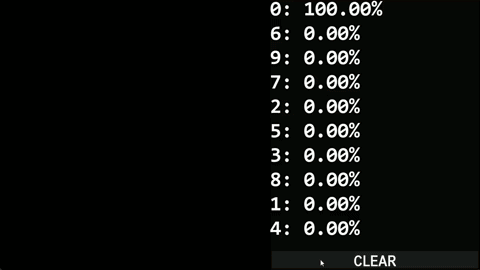

# Digit Classifier

A simple digit-classifying neural-network created with PyTorch.

I created this program to familiarize myself with artificial intelligence, neural networks, and PyTorch.

This project was heavily inspired by a [video from Sebastian Lague](https://www.youtube.com/watch?v=hfMk-kjRv4c)

## Latest Executable
https://github.com/baig-mirza-mm/DigitClassifier/releases/tag/v1.1
